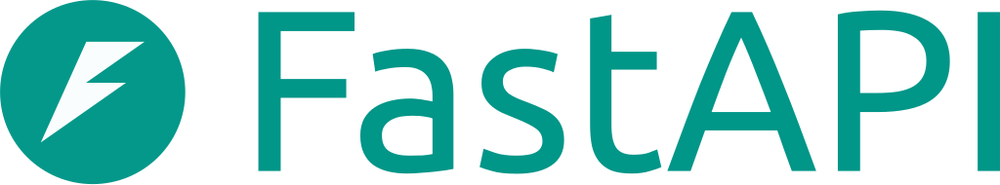
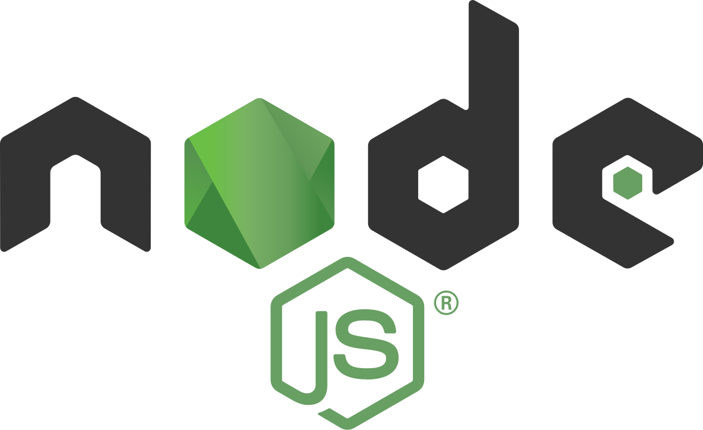
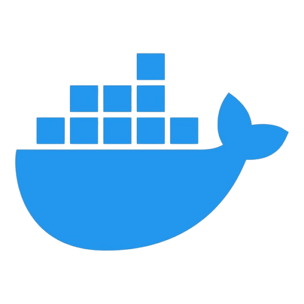
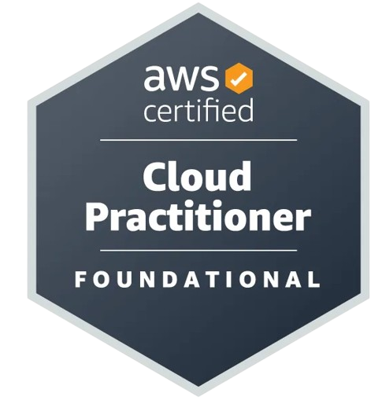

## Hey there 👋 - I'm Ayman Haque

- 🔭 I’m currently working on [CrossMart - The Borderless MarketPlace](https://github.com/aymanhaque/Cross-Mart)
- 🌱 I’m currently learning cloud fundamentals and monitoring/observability
- 📫 How to reach me: muhd.ayman.haque@gmail.com

## Tools and Languages:

 

# Certifications

  

<!-- - 💬 Ask me about ... -->
<!-- - ⚡ Fun fact: ...  -->
<!-- - 🤔 I’m looking for help with ... -->
<!-- - 😄 Pronouns: ... -->
<!-- - 👯 I’m looking to collaborate on ... -->
<!-- **aymanhaque/aymanhaque** is a ✨ _special_ ✨ repository because its `README.md` (this file) appears on your GitHub profile. -->